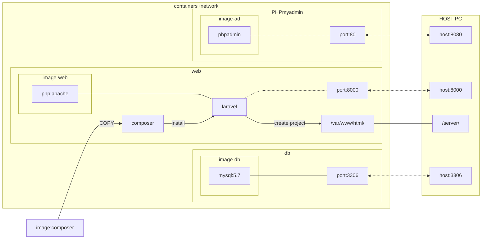

# nkc-lecture-proj
2022/05/17 Tsujimura
以下のURLを参考に環境を構築した。（Dockerfile, docker-compose.ymlのみカスタマイズ） 
https://qiita.com/A-Kira/items/9a03d7b230741ed7b1de

## ディレクトリ構成
- []囲みはディレクトリ.
- Laravelプロジェクトファイルは[server]配下に作成される。

<pre>
[project]
├── [docker]
│       ├── Dockerfile
│       ├── [apache]
│       │     └── 000-default.conf
│       ├── [db]
│       │     ├── [data]
│       │     ├── my.cnf
│       │     └── [sql]
│       │  　       ├── 001-create-tables.sql  
│       │ 　        └── init-database.sh     
│       └──  [php]                         
│             └── php.ini                 
├── docker-compose.yml                    
└── [server]                              
</pre>
## コンテナ概念図
mermaid記法による。依存をこれ以上記入すると図が崩れるので悩み中。

## コンテナ運用方法
- 毎回[project]ディレクトリよりコンテナ起動。`docker-compose up -d`
- コンテナ内部に入る。`docker-compose run web bash`
(以下コンテナ内作業)
- (初回のみ:プロジェクトフォルダが無い場合)プロジェクトフォルダを作成。`laravel new <任意のプロジェクト名>`
- Larabelのプロジェクトディレクトリへ移動`cd <プロジェクト名=フォルダ>`
- (2回目以降:プロジェクトフォルダが既にある場合)vendorディレクトリを取得（ないとserve実行時にエラーが出ます）　`composer install`
- （今回省略可）環境設定ファイル/.envにmysqlの接続用パラメータを記述（本来セキュリティの関係で.envファイルをリモートリポジトリで管理することは非推奨。test_project/.gitignoreにて自動作成されていた無視設定を手動で有効化し、リポジトリに含めています。）
- データべースへのテーブル作成（マイグレーション）`php artisan migrate`
- （`php artisan migrate:status`でマイグレーションファイル取り込みの履歴が確認できます）
- データベース、テーブルへのデータ流し込み（シーディング）`php artisan db:seed`
- Larabelのサーバー起動`php artisan --host=0.0.0.0 serve`
- (server, dbディレクトリの内容はコンテナ削除後も残り、次回以降コンテナ立ち上げ時に自動取り込みされる？？)

## github運用について
- github flow??
- 基本的にはmainブランチを動く最新版とする。
- 開発用には<feature/(個人名）で作成したbranchを利用する。
- 個人ブランチは適宜pushを行いリモートリポジトリに反映する（粒度はお任せです：使ってみて検討しましょう。）
- 一定の機能が完成するごとに、mainブランチにpull requestを行う。

（その他）
- gitでの管理範囲に注意。（基本的には作成したソースコードのみ管理。Larabelの自動作成ファイルを含めない？）

## コンテナ設定の補足
参考資料について、一部修正を加えることでphpadminおよびLarabelのホームページ表示成功しました。

1,バージョン指定ミス（Dockerfile）

  <ul>
<li> その１：正規表現(^,*)が正しくない（windowsだから？）</li>
<li> その２：Larabel/installerにはバージョン4系までしかない。（エラーメッセージより）</li>
  </ul>
誤）
  <code>
  RUN composer global require "laravel/installer=~8.*"`
  </code> 
  正）
  <code>
  RUN composer global require "laravel/installer=4.*"
  </code> 
　or
  <code>
  RUN composer global require laravel/installer
  </code> 

2, ライブラリのインストールエラー（Dockerfile）

  <pre>
  && docker-php-ext-install zip pdo_mysql mysqli \
  にてエラー発生。libzipがどうのこうの。
  直上に以下を追加。https://qiita.com/Taki_Kazuya/items/454f399fb7e0e72fbd18
  && apt-get install -y libzip-dev\
  </pre>

3,ポートのマッピング(要確認）（Docker-compose.yml）

Webコンテナのポート指定。
厳密には誤では無いと考えられるが、Larabelで利用するデフォルトのコンテナ側ポートが8000なので、ひとまずの動作確認では以下の方が良いかと。
<pre>
 参考資料）
`- 80:80`
修正）
- 8000:8000
</pre>
追記）Webサーバーで80番ポートを指定した場合、既に使われている扱いとなり81番が代わりに使われる。
<pre>
  root@b836ab74001d:/var/www/html/test_project# php artisan --host=0.0.0.0:80 serve
  Starting Laravel development server: http://0.0.0.0:80
  [Tue May 17 12:41:57 2022] Failed to listen on 0.0.0.0:80 (reason: Address already in use)
  Starting Laravel development server: http://0.0.0.0:81
  [Tue May 17 12:41:58 2022] PHP 7.4.29 Development Server (http://0.0.0.0:81) started`
  </pre>

4,コンテナ立ち上げ後の作業説明が足りてない。

https://qiita.com/A-Kira/items/9a03d7b230741ed7b1de
今回の参考URLの「6. Laravelプロジェクト作成」、以下が正となる。
<pre>
% docker起動
$ docker-compose up -d

% webコンテナに入ります
$ docker-compose exec web bash

% Laravelプロジェクト作成
$ laravel new <任意のプロジェクト名>

$ cd <プロジェクト名=フォルダ>
$ php artisan serve

(余談：最後の行、より確実に動くのはこちら）
php artisan --host=0.0.0.0 serve
</pre>

